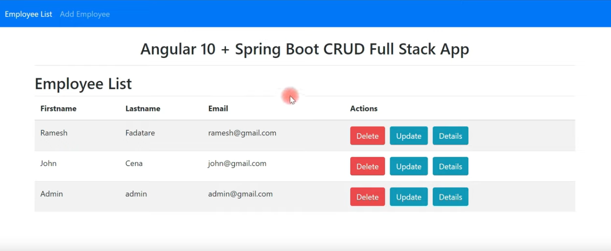
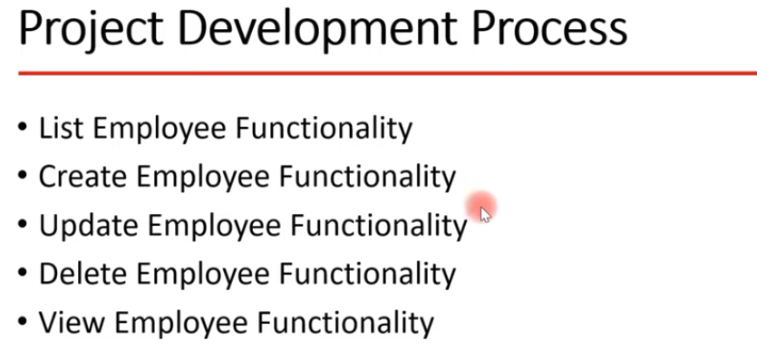
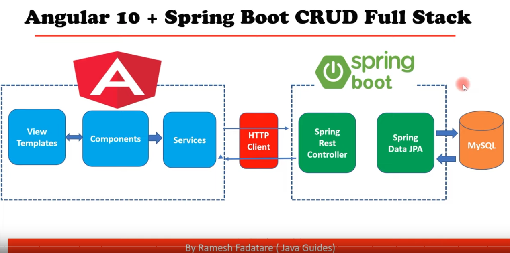
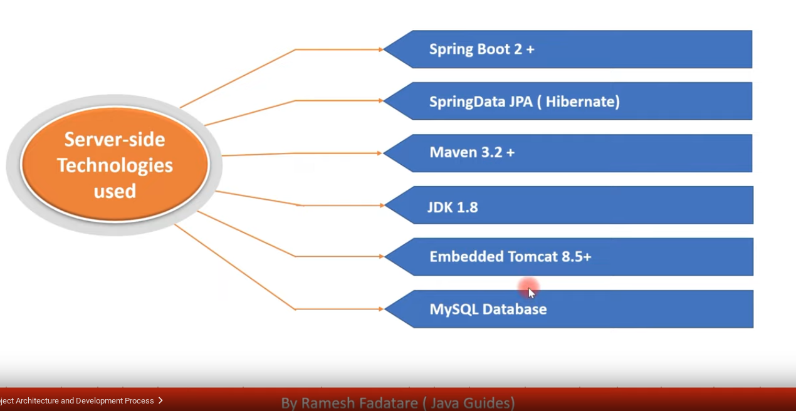
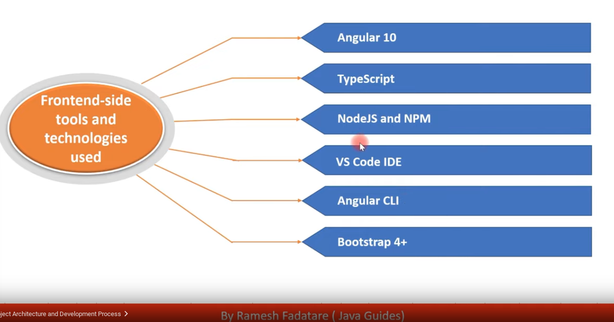

# Implementation and notes made by learning Java-Guides-Course: Angular Spring-Boot Application with MariaDB Crud API and REST requests (@RameshMF)
***An Anglular 12 and Spring Boot CRUD Full Stack App.***

**Java-Guides-Sources:**

* https://www.youtube.com/watch?v=G46fjVzQ7BQ

* https://github.com/RameshMF/Angular-10-Spring-Boot-CRUD-Full-Stack-App

**Personal notes frontend:**

<a href="./frontend/README.md" target="_top">README Frontend</a>

**Personal notes backend:**

<a href="./backend/README.md" target="_top">README Backend</a>

**APP:** 

**Functionalities:**

**Architecture:**

**Backend-side (Server-side) Technologies:**

**Frontend-side Technolgoies:**

