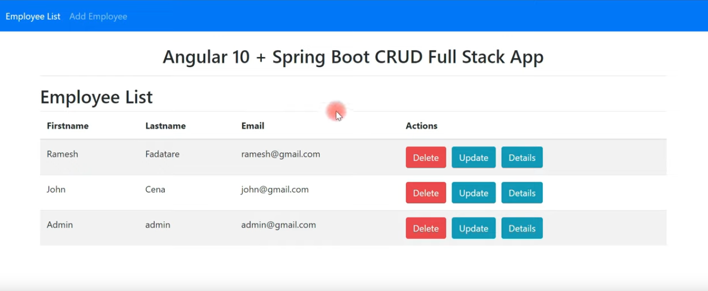
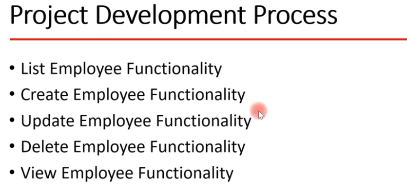
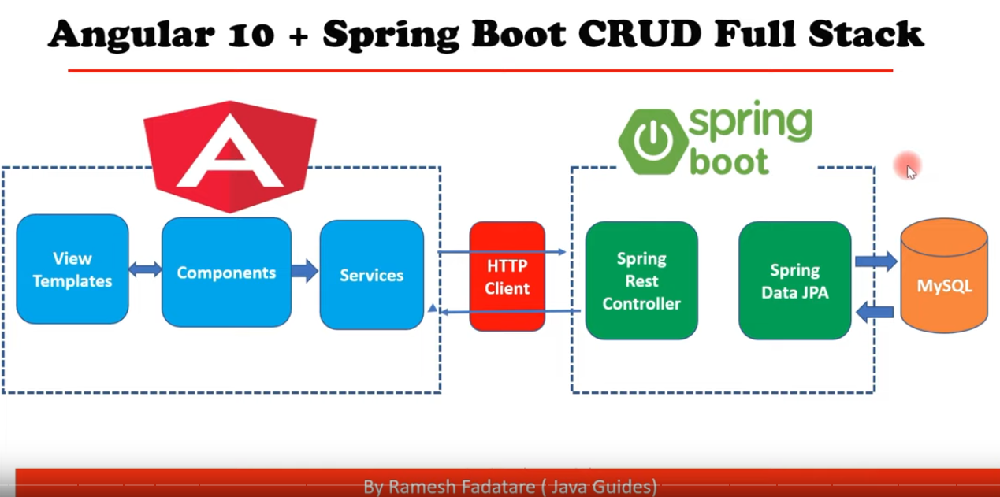
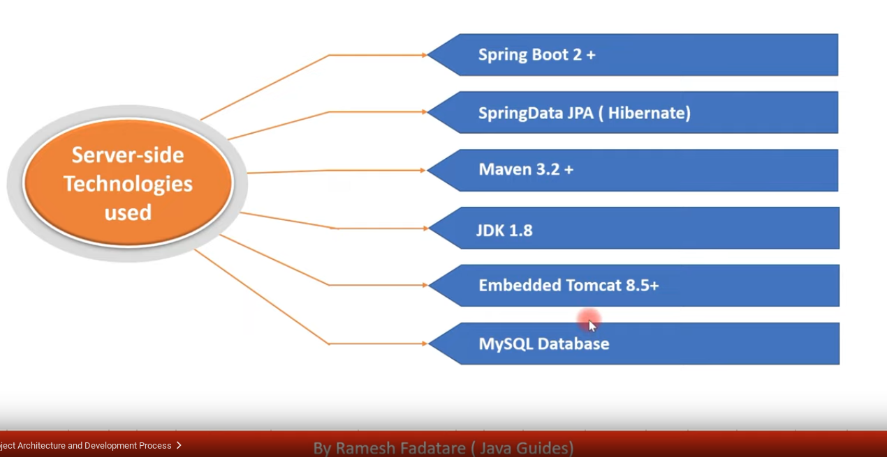
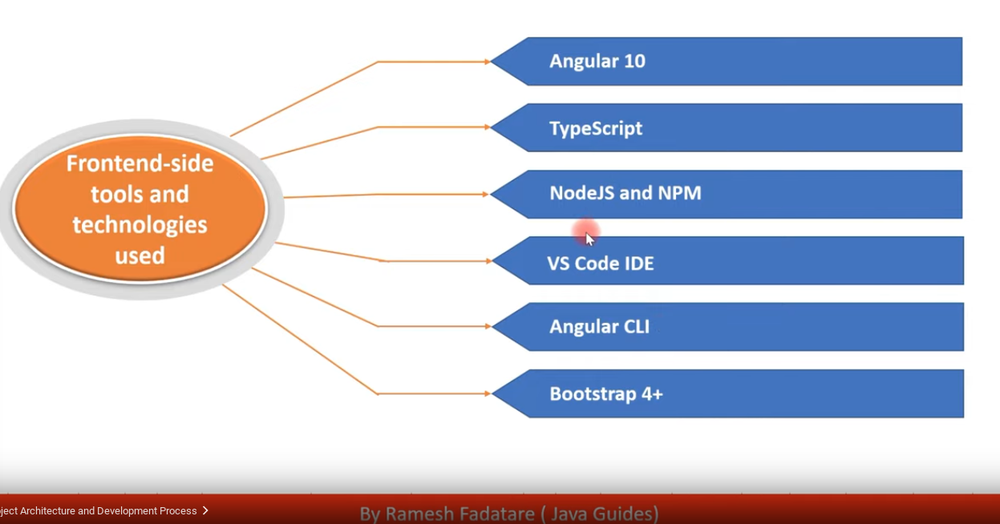

https://www.youtube.com/watch?v=G46fjVzQ7BQ

#**Course Angular Spring-Boot Application with MariaDB Crud API and REST requests:**
An Anglular 12 and Spring Boot CRUD Full Stack App. 

**APP:** 

**Functionalities:**

**Architecture:**

**Backend-side (Server-side) Technologies:**

**Frontend-side Technolgoies:**

#**Details Frontend:**

<a href="./frontend/README.md" target="_top">README Frontend</a>

#**Details Backend:**

<a href="./backend/README.md" target="_top">README Backend</a>

[comment]: <> (**:**)

[comment]: <> (![]&#40;../&#41;)

[comment]: <> (**:**)

[comment]: <> (![]&#40;../&#41;)

[comment]: <> (**:**)

[comment]: <> (![]&#40;../&#41;)

[comment]: <> (**:**)

[comment]: <> (![]&#40;../&#41;)

[comment]: <> (**:**)

[comment]: <> (![]&#40;../&#41;)

[comment]: <> (**:**)

[comment]: <> (![]&#40;../&#41;)

[comment]: <> (**:**)

[comment]: <> (![]&#40;../&#41;)

[comment]: <> (**:**)

[comment]: <> (![]&#40;../&#41;)

[comment]: <> (**:**)

[comment]: <> (![]&#40;../&#41;)

[comment]: <> (**:**)

[comment]: <> (![]&#40;../&#41;)

