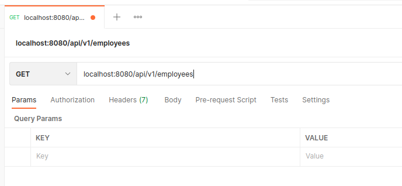
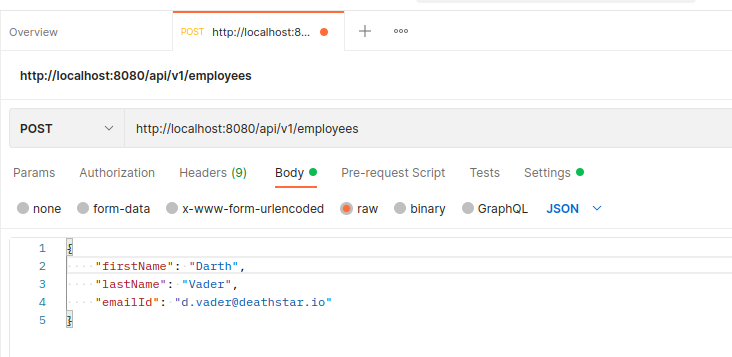
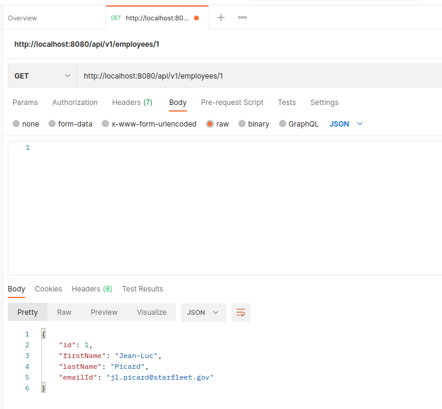
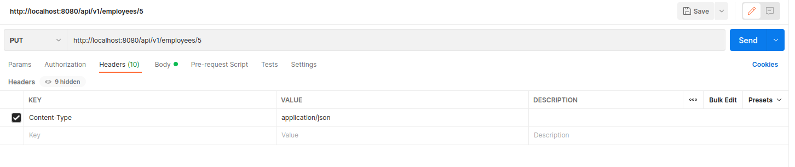
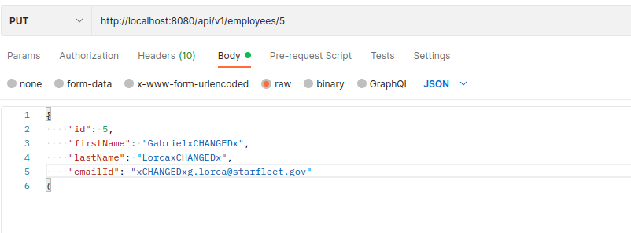
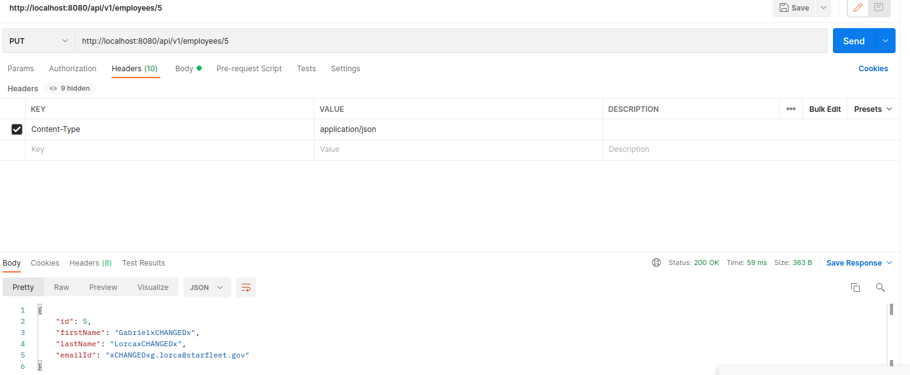
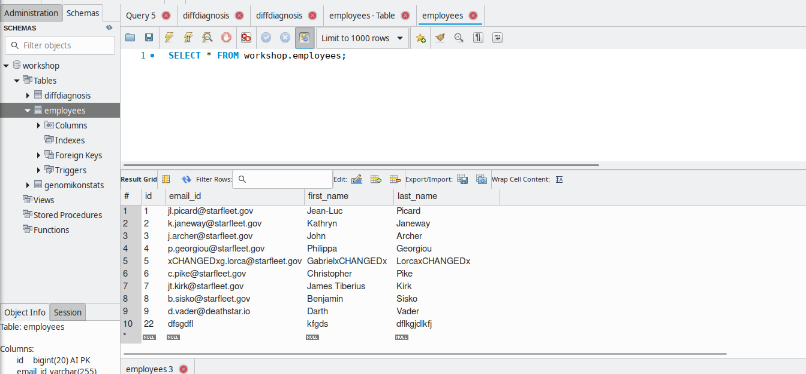
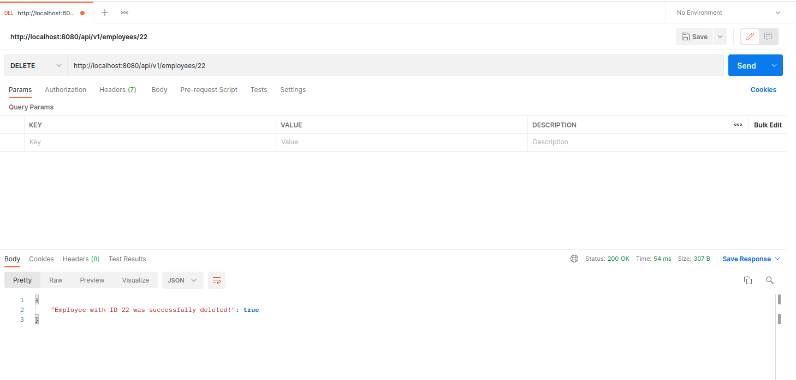

# Creating backend:

https://www.youtube.com/watch?v=G46fjVzQ7BQ

#Database config:
Add database config (url, username, password for database and hibernate properties) to backend/src/main/resources/application.properties
Template for application.properties:

    #add user and pw for db
    spring.datasource.url=jdbc:mysql://<server-name>:<port>/<database-name>?useSSL=false
    spring.datasource.username=....
    spring.datasource.password=....
    
    ##################################### for MySQL #####################################
    #spring.jpa.properties.hibernate.dialect = org.hibernate.dialect.MySQL5InnoDBDialect
    #
    # to automatically create a table in the database
    # Hibernate ddl auto (create, create-drop, update): with "update" the database
    # schema will be automatically updated accordingly to java entities found in
    # the project
    spring.jpa.hibernate.ddl-auto = update
    #####################################################################################

    #################################### for MariaDB ####################################
    #required:
    spring.datasource.driver-class-name=org.mariadb.jdbc.Driver
    
    # Allows Hibernate to generate SQL optimized for a particular DBMS
    #required:
    spring.jpa.properties.hibernate.dialect=org.hibernate.dialect.MariaDB103Dialect
    
    #optional (MariaDB):
    #Hibernate Configuration
    # Show or not log for each sql query
    spring.jpa.show-sql=true
    
    # Naming strategy
    spring.jpa.hibernate.naming.implicit-strategy=org.hibernate.boot.model.naming.ImplicitNamingStrategyLegacyHbmImpl
    spring.jpa.hibernate.naming.physical-strategy=org.springframework.boot.orm.jpa.hibernate.SpringPhysicalNamingStrategy
    spring.jpa.open-in-view=false
    
    # Spring Data Rest Setup
    spring.data.rest.base-path=/api
    
    ## Spring Server setup
    #server.address=127.0.0.1
    #server.port=8080
    #server.compression.enabled=true
    #server.http2.enabled=true
    #####################################################################################

#Add packages to backend:
**model:**

add `employee` class with JPA table annotations.
    
**conroller:**

**repository:**

add repository interface `EmploeeRepository`.

**exception:**

#Create RESTful services:

Add to exception package the `ResourceNotFoundException` class. It can be thrown if a resource not exists in the database.
It should extends `RuntimeException`, which internally implements serializable. With ResponseStatus it returns a not found http status to the client.

#**Create Requests to REST API (in controller):**

Add common URL path and repository to the controller:

    @CrossOrigin(origins = "http://localhost:4200")
@RestController
@RequestMapping("/api/v1") // defines a standard url over here, this a typically endpoint of a rest api
public class EmployeeControler {

    @CrossOrigin(origins = "http://localhost:4200")
    @RestController
    @RequestMapping("/api/v1") // defines a standard url over here, this a typically endpoint of a rest api
    public class EmployeeControler {

        @Autowired // to inject this repository by spring container
        private EmployeeRepository employeeRepository;
    }

Add methods for different requests. Here are some examples for different request types like GET, PUT etc.

**GET-Request:**

    // get all
    @GetMapping("/employees") // on call url "/api/v1/employees" in brwoser the api will return a list of emloyees
    public List<Employee> getAllEmployees() {
        return employeeRepository.findAll();
    }

Test with Postman on myworkspace -> APIs:

**POST-Request:**

    // add a item to all items (same URL)
    @PostMapping("/employees")  
    public Employee createEmployee(@RequestBody Employee employee) {
        return employeeRepository.save(employee);
    }

Test with Postman on myworkspace -> APIs:

CAVE: select `Body` -> `raw` and `JSON` (instead of `Text`), the id is not nesessary, it will be set automatically.

**Creating Get Employee By Id REST API:**

In EmployeeControler add method:

    @GetMapping("/employees/{id}") 
    public ResponseEntity<Employee> getEmployeeById(@PathVariable Long id) {
        Employee employee = employeeRepository.findById(id)
                .orElseThrow(() -> new ResourceNotFoundException("Employee not exist with id:" + id));
        return ResponseEntity.ok(employee);

restart spring boot backend app and test method with postman:

**Creating Update Employee REST API:**

In EmployeeControler add method:

        @PutMapping("/employees/{id}")    
        public ResponseEntity<Employee> updateEmployee(@PathVariable Long id, @RequestBody Employee changedEmployee) {
        
            Employee employee = employeeRepository.findById(id)
                    .orElseThrow(() -> new ResourceNotFoundException("Employee not exist with id:" + id));
            
            employee.setFirstName(changedEmployee.getFirstName());
            employee.setLastName(changedEmployee.getLastName());
            employee.setEmailId(changedEmployee.getEmailId());
           
            Employee updatedEmployee = employeeRepository.save(employee);
            return ResponseEntity.ok(updatedEmployee);
    }

Restart spring boot application and test this method with postman. In header of the PUT-request add json as content type:

And add the changed values to body JSON raw data:

Execute the PUT-request:

Check in database the result of the PUT-request:

-> in frontend create angular update employee component

**Creating Delete Employee REST API:**

In EmployeeControler:

        @DeleteMapping("/employees/{id}")
        public ResponseEntity<Map<String, Boolean>> deleteEmployee(@PathVariable Long id) {
            Employee employee = employeeRepository.findById(id)
                  .orElseThrow(() -> new ResourceNotFoundException("Employee not exist with id:" + id));
            employeeRepository.delete(employee);
            Map<String, Boolean> response = new HashMap<>();
            response.put("Employee with ID " + id + " was successfully deleted!", Boolean.TRUE);
            return ResponseEntity.ok(response);
    }

[comment]: <> (**:**)

[comment]: <> (![]&#40;../&#41;)

[comment]: <> (**:**)

[comment]: <> (![]&#40;../&#41;)

[comment]: <> (**:**)

[comment]: <> (![]&#40;../&#41;)

[comment]: <> (**:**)

[comment]: <> (![]&#40;../&#41;)

[comment]: <> (**:**)

[comment]: <> (![]&#40;../&#41;)

[comment]: <> (**:**)

[comment]: <> (![]&#40;../&#41;)

[comment]: <> (**:**)

[comment]: <> (![]&#40;../&#41;)

[comment]: <> (**:**)

[comment]: <> (![]&#40;../&#41;)

[comment]: <> (**:**)

[comment]: <> (![]&#40;../&#41;)
