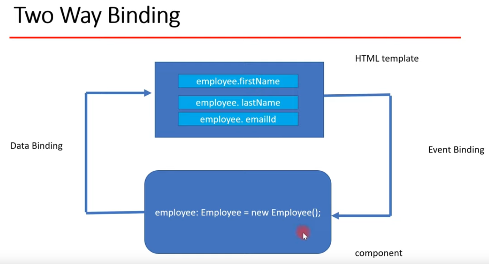

# Creating frontend:

https://www.youtube.com/watch?v=G46fjVzQ7BQ

# **Frontend:**

Integrate Bootstrap 5 css library in the angular to make the app responsive and stylish.
1. Install the latest Bootstrap:
  
        npm install bootstrap --save

   And add to `angular.json` in section `styles`:

    "./node_modules/bootstrap/dist/css/bootstrap.css"

2. Alternatively you can add to global `styles.css`:

    @import "~bootstrap/dist/css/bootstrap.min.css";

3. Or alternatively you can download bootstrap css through remote link. 
Execute a google search for "bootstrap 5 cdn link":
https://getbootstrap.com/docs/5.0/getting-started/introduction/
    
    Copy CSS link from there and add it to `index.html` head section:
    
        <link href="https://cdn.jsdelivr.net/npm/bootstrap@5.0.2/dist/css/bootstrap.min.css" rel="stylesheet" integrity="sha384-EVSTQN3/azprG1Anm3QDgpJLIm9Nao0Yz1ztcQTwFspd3yD65VohhpuuCOmLASjC" crossorigin="anonymous">

For each functionality (create, list, update, datails) a separate component is created.
Communication with REST API is done by a Service. The Service is injected to each component.

REST API calls are needed for GET, POST (to modify or update), PUT (to create or overwrite) and DELETE.

Create a typescript class for Employee model which contains properties:
 
    ng g class employee

It is created to hold a response of the REST APIs. Add all properties that are defined in springboot app there.

Add components with:

    ng g c <name of component>

!!!CAVE: To make class works go to `tsconfig.json` and set

    "strictPropertyInitialization": false

# **Connecting Angular with list employee REST API:**

**Angular Service:**
* to share the data among various components in an Angular app
* to make the Testing and Debugging simple
* a component can delegate certain tasks to service, such as fetching data from the server, validating
user input, or logging directly to the console
* to define a class as a service in Angular, use the `@Injectable()` decorator to provide the metadata
that allows Angular to inject it into a component as a dependency.
  
create service to make the REST API calls:

    ng g s <name of the service>

Add `HttpClientModul` to `app.module.ts` and import it with:

    import { HttpClientModule } from "@angular/common/http";

Inject `HttpClient` in `employeeshare.service.ts`.
Define properties of the service and a method which makes a GET request on the whole `Employee[]` object:

    getEmployeesList(): Observable<Employee[]> { 
      return this.httpClient.get<Employee[]>(`${this.baseURL}`);  // backticks!
    }

In `employee-list-component.ts` inject the service in constructor. Add a private method `getEmployees`

      private getEmployees() { 
        this.employeeshareService.getEmployeesList()
          .subscribe(data => {
            this.employees = data;
          });
}

and execute it in `ngOnInit()`.

# **Add routing:**

1. Add `<base href="/">` to the head of `index.html`.
2. Create `app-routing.module.ts` and define routes there.
3. Add AppRoutingModule to the imports-array of the `app.module.ts`.
4. Configure a router outlet in `app.component.html`.

# **Two-Way-Binding in components:**

Bindings betweeen HTML-template and component-TypeScript-class. Whenever something is changed in component, in template
the .ts will get updated. And whenever changes in model properties of component .ts-class where done then the corresponding
properties will get updated in html template.

**Property Binding (=Data Binding):** properties are defined in component .ts-class and can be binded in html-template => interpolation.

**Event Binding:** to perform some events on html template it should be bind in component .ts-class.

1. Angular provides Two-Way-Binding and also provides `ngModel` directive for this. Add a new component
for this:

    ng g c create-employee

2. Add path for the new component to `app-routing.module.ts`.

3. Add the link to the Component in `app.component.html`

4. Define a property in new component .ts-class:
           
        employee: Employee = new Employee();

5. Add Form to html-template which uses ngSubmit for event handling and ngModel for two-way-binding:

        <form (ngSubmit)="onSubmit()"> 
          

            <label>First Name</label>
            <input type="text" class="form-control" id="firstName"
                   [(ngModel)]="employee.firstName"
                   name="firstName">
          

        </form>

Attention: ngModel needs the import of Forms-Module in the `app.module.ts`.

6. Implement the event-handler `onSubmit` in `component.ts` class and connect Angular with 
   the add employee REST API to send form data to MariaDB: See next section.
   

# **Connect user input with REST API to send form data to MariaDB:**

1. Add method to the `employee.service.ts` which will make a REST API call and will send the data
form from data trough REST API and REST API internally store data into MariaDB database:
   
          createEmployee(employee: Employee): Observable<Object> {
            return this.httpClient.post(`${this.baseURL}`, employee)
          }
2. Inject the service to the constructor of the `create-employee.component.ts`.
3. Create a method to save employee in `create-employee.component.ts` which uses the service and 
   subscribe to him and navigate back to the employee list (see [4.]):
   
          saveEmployee() {
            this.employeeshareSerivce.createEmployee(this.employee)
            this.employeeshareSerivce.createEmployee(this.employee)
            .subscribe(data => {
            console.log(data);
            this.goToEmployeeList();
            },
            error => console.log(error)); 
            }
4. Add router to the constructor of the `create-employee.component.ts` for navigation and implemnt
   a method to navigate to the corresponding path / to employee list page:
   
          goToEmployeeList() {
            this.router.navigate(['/employees'])
          }
5. In `onSubmit()` event-handler for two-way-binding add these methods:

          onSubmit() {  // event-handler for ngSubmit of the form from html-template
            console.log(this.employee);
            this.saveEmployee();
          }

**Creating Angular Update Employee Component:**

In frontend directory create a new component:

    ng g c update-employee

Add component and its path with particular id from REST API to app-routing.module.ts:

    {path: 'update-employee/:id'}

-> Whenever this url path ist called, the update component will be rendered.
Add update button to each employee entry in employee list, on click one of the buttons, 
it will be navigate to update-employee page (rendered from update-employee component).
For this add to the employee-list.component.html:

      <td>
        <button (click)="updateEmployee(employee.id)" class="btn btn-info"> Update </button>
      </td>

and to the employee-list.component.ts: 

        updateEmployee(id: number | undefined) {
            if (id !== undefined) {
              this.router.navigate(['update-employee', id]);
            }
        }

This will navigate to url `/update-employee/{id}`.

**Connecting Angular with Get Employee REST API:**

To fill up input fields of updateEmployeeComponent with data of the corresponding employee, retrive this data with a REST call on getEmployeeById().
To populate the response of the REST API call of an specific employee with a specific id in the update employee page.
For this add to employeeshare.service.ts: 

      getEmployeeById(id: number): Observable<Employee> {
        return this.httpClient.get<Employee>(`${this.baseURL}/${id}`);
      }

Import the service to updateEmployeeComponent and get the corresponding id from route with a snapshot of ActivatedRoute:

      ngOnInit(): void {
        this.id = this.route.snapshot.params['id']; // to get id value
        if (this.id !== undefined) {
          this.employeeService.getEmployeeById(this.id).subscribe(data => {
            this.employee = data;
          }, error => console.log(error));
        }
      }

**Store updated Employee to database - Connecting Angular with update Employee REST API:**

Add in employeeshare.service.ts a new REST call to save updated employee data:

      updateEmployee(id: number, updatedEmployee: Employee): Observable<Object> {
        return this.httpClient.put(`${this.baseURL}/${id}`, updatedEmployee);
      }

In update-employee.component.ts add the onSubmit method which initiate the REST call and route to employee list:

      onSubmit() {
        if (this.id !== undefined) {
          this.employeeService.updateEmployee(this.id, this.employee).subscribe( data => {
            this.goToEmployeeList();
          }, error => console.log(error));
        }
      }      

      goToEmployeeList() {
        this.router.navigate(['/employees'])
      }

**Connecting Angular with Delete Employee REST API:**

Add the delete button to the employee-list.component.html:

    <button (click)="deleteEmployee(employee.id)" class="btn btn-danger" style="margin-left: 10px"> Delete </button>

and implement the `deleteEmployee()` method in employee-list.component.ts:

      deleteEmployee(id: number | undefined) {
        if (id !== undefined) {
          this.employeeshareService.deleteEmployee(id).subscribe( data => {
            this.getEmployees();
          });
        }
      }

Add the delete REST call to the employeeshare.service.ts:

      deleteEmployee(id: number): Observable<Object> {
        return this.httpClient.delete(`${this.baseURL}/${id}`);
      }

**Creating View Employee Details Functionality:**

Add a new employee-details component with the command (in /frontend folder):

    ng g c employee-details

Configure route for employee-details in app-routing.module.ts:

    {path: 'employee-details/:id', component: EmployeeDetailsComponent}

Create a button and click-handler in employee-list-component to navigate to EmployeeDetailsComponent:

    <button (click)="employeeDetails(employee.id)" class="btn btn-outline-primary" style="margin-left: 10px"> View </button>
    employeeDetails(id: number | undefined) {
        this.router.navigate(['employee-details', id]);
    }

In employee-details.component.ts use activated Route to get the id from the Route (injection into component via constructor).
    
    id: number;
    employee: Employee;

    constructor(private route: ActivatedRoute) { }

    ngOnInit(): void {
        this.id = this.route.snapshot.params['id'];
    }

Use the getEmployeeById-method from employeeshare.service.ts to get the employee data from a specific id. For this
inject the employeeshare.service in employee-details.component and call this method:

    id: number | undefined;
    employee: Employee | undefined;

    constructor(private route: ActivatedRoute, private employeeService: EmployeeshareService) { }

    ngOnInit(): void {
        this.id = this.route.snapshot.params['id'];
        if (this.id !== undefined && this.employee !== undefined) {
            this.employee = new Employee();           
            this.employeeService.getEmployeeById(this.id).subscribe(data => {
                this.employee = data;
            });
        }
    }

Implement html-code for the employee-details view in employee-details.html.
